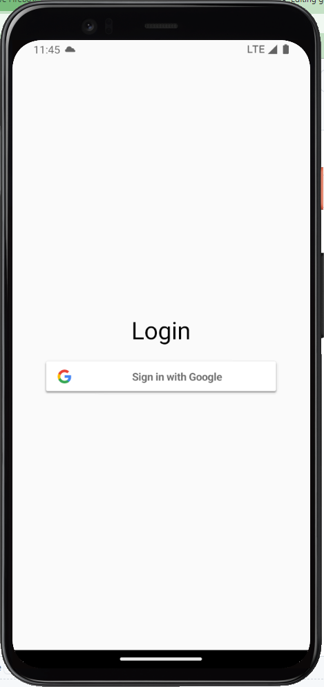
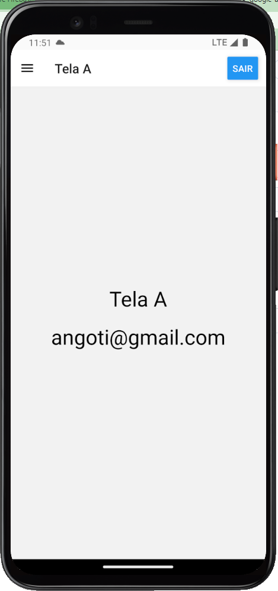
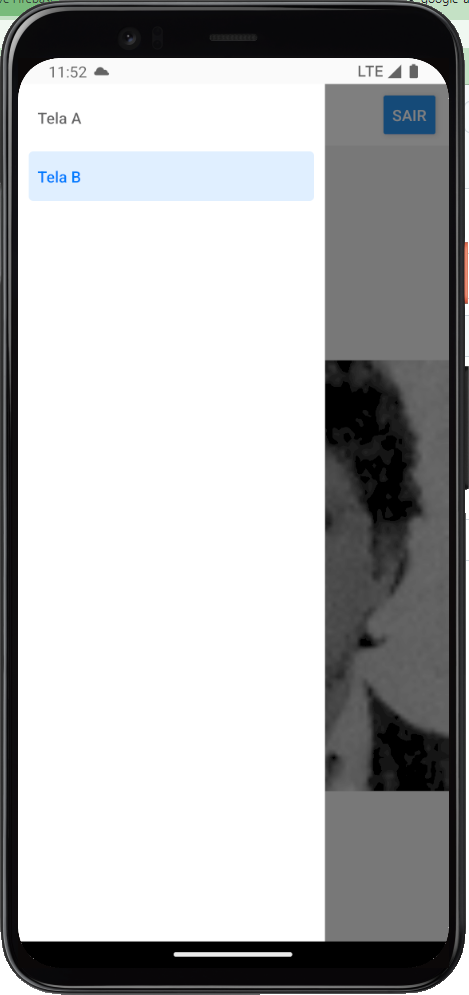

# google-auth-expo

App demonstrativo de uso da autenticação Firebase/Google usando Expo react native.

## 💻 Instruções para executar o app 
Siga rigorosamente as instruções
 1. Execute os comandos na raiz do projeto:
<pre>npm install
npx expo prebuild --clean
</pre>
2. Configuração da biblioteca React Native Firebase: (siga as instruções até o fim da página) [Android setup](https://rnfirebase.io/#2-android-setup)
3. Configuração da biblioteca React Native Google Signin: (siga as instruções rigorosamente) [React Native Google Signin](https://github.com/react-native-google-signin/google-signin)

4.1 Para executar no emulador: <pre>npx expo run:android</pre>
4.2 Para executar no dispositivo conectado por cabo usb: <pre>npx expo run:android</pre>
Referencias: 
[Development build](https://docs.expo.dev/develop/development-builds/development-workflows/#build-locally-with-android-studio-and-xcode) 
[Android setup](https://rnfirebase.io/#2-android-setup) 
[React Native Google Signin](https://github.com/react-native-google-signin/google-signin)

## 🚀 Instruções para construir o apk
1. Criar o arquivo keystore na pasta android/app

<pre>keytool -genkey -v -keystore app.keystore -alias your_key_alias -keyalg RSA -keysize 2048 -validity 10000</pre>

2. Editar o arquivo <i>android\app\build.gradle</i>

<pre>android {
....
  signingConfigs {
    release {
      storeFile file('app.keystore')
      storePassword 'senha informada na criação do arquivo app.keystore'
      keyAlias 'nome alias informado na criação do arquivo app.keystore'
      keyPassword 'senha alias informada na criação do arquivo app.keystore'
    }
  }
  buildTypes {
    release {
      ....
      signingConfig signingConfigs.release
    }
  }
}</pre>

3. Verifique se existe uma pasta com o nome <i><b>assets</b></i> dentro de <i><b>android/app/src/main</b></i>. Se não existir, crie a pasta <i><b>assets</b></i>

4. Execute o comando na raiz do projeto

<pre>npx react-native bundle --platform android --dev false --entry-file index.js --bundle-output android/app/src/main/assets/index.android.bundle --assets-dest android/app/src/main/res/</pre>

5. Execute a sequência de comandos para gerar o apk
 
<pre>cd android
gradlew assembleRelease</pre>

o arquivo gerado fica em: <pre>android/app/build/outputs/apk/app-release.apk</pre>
Caso aconteça erro, execute os seguintes comnandos e repita o passo 4.

<pre>rm -rf ./android/app/src/main/res/drawable-*</pre>

<pre>rm -rf ./android/app/src/main/res/raw</pre>
