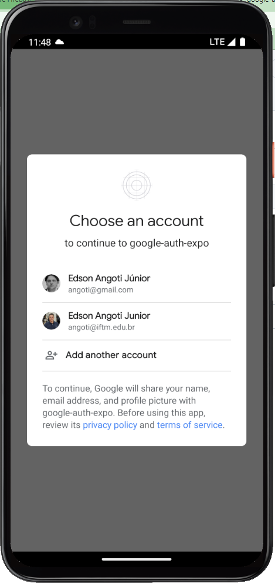

# google-auth-expo

App demonstrativo de uso da autenticação Firebase/Google usando Expo react native.

## 💻 Documentação 

Siga rigorosamente as instruções
- Execute o comandon: <code>npx expo prebuild --clean</code>
- React Native Firebase [Android setup](https://rnfirebase.io/#2-android-setup)
- React Native Firebase integração com Expo [managed workflow](https://rnfirebase.io/#managed-workflow).
- Para executar: <code>npx expo run:android</code> [Development build](https://docs.expo.dev/develop/development-builds/development-workflows/#build-locally-with-android-studio-and-xcode)

